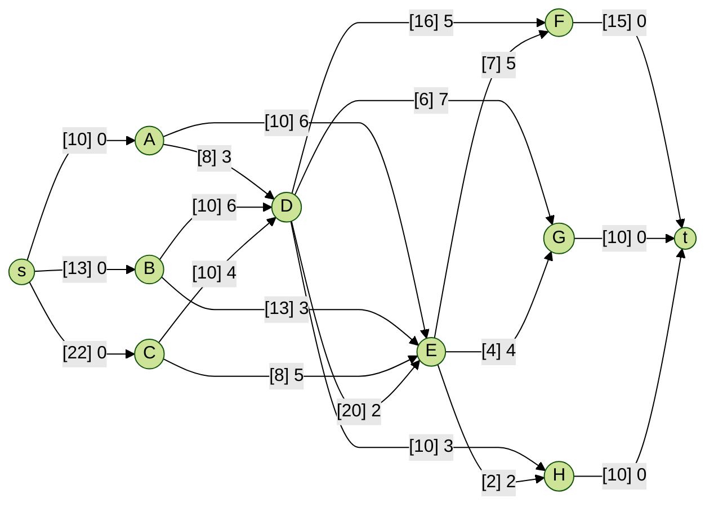

# Flow Network

The dispatch center is planning coal deliveries from specific mines to power plants. The possibility of delivering hard
coal from three mines A, B, and C to three power plants F, G, and H is being considered, using a railway network with
two intermediate stations D and E.

- Unit transport costs and throughput on individual sections are (arc direction is from row to column):
- Cost:

|   | D | E | F | G | H |
|---|---|---|---|---|---|
| A | 3 | 6 | - | - | - |
| B | 6 | 3 | - | - | - |
| C | 4 | 5 | - | - | - |
| D | - | 2 | 5 | 7 | 3 |
| E | - | - | 5 | 4 | 2 |

- Throughput:

|   | D  | E  | F  | G | H  |
|---|----|----|----|---|----|
| A | 8  | 10 | -  | - | -  |
| B | 10 | 13 | -  | - | -  |
| C | 10 | 8  | -  | - | -  |
| D | -  | 20 | 16 | 6 | 10 |
| E | -  | -  | 7  | 4 | 2  |

- The mining capacity of the mines is (in thousands of tons): $W_A = 10, W_B = 13, W_C = 22$.
- The average daily coal consumption by power plants is (in thousands of tons): $Z_F = 15, Z_G = 10, Z_H = 10$.

The task is to determine a daily coal supply plan that meets the power plant's demand and minimizes total transportation
costs. To do this, you must:

- formulate and draw a network model (flow network); determine the problem to be solved in this network (name the
  problem to be solved, not the algorithm);

- find the best possible solution (using any manual or algorithmic method);

- write the corresponding linear programming problem.

Furthermore, you must determine where the bottleneck in the transportation network exists, which would constitute a
limitation in the event of increased demand from the power plant (transportation costs should be ignored). To do this,
you must find the section with the lowest possible capacity; what information does the capacity of the selected section
convey?

